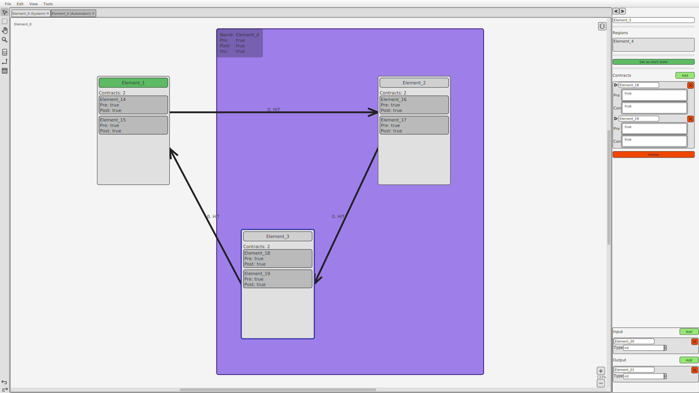

# Gecko

<p align="center">
  
</p>

<p align="center">
<a href="https://github.com/DecwLK/Gecko/releases"></a>
<a href="https://github.com/DecwLK/Gecko/releases"></a>
<a href="https://opensource.org/licenses/"></a>
</p>

Gecko is a graphical editor for contract automata.



## Table of Contents

- [Introduction](#introduction)
- [Installation](#installation)
- [Building](#building)
- [License](#license)

## Introduction

The correct functionality of reactive systems, such as control units in cars and airplanes,
can be secured using contract automata. Contract automata are a formalism for specifying and
verifying software components. As an extension of finite automata, contract automata have
states and state transitions that are secured by contracts. Since contract automata for
modeled systems become large and their contracts lengthy, a graphical editor that allows for clear
manipulation of systems and automata is helpful. This is exactly what Gecko does. Because Gecko
understands the formalism of contract automata, the editor is a useful tool for software specification,
facilitating the editing of contract automata. Additionally, Gecko adds new abstractions to the model,
making the editing of contract automata more manageable for the user.

## Installation

To install Gecko, download the latest release from the [releases page](https://github.com/DecwLK/Gecko/releases).

`Gecko.jar` can be run on any system with [Java 21](https://www.oracle.com/java/technologies/downloads/) or later
installed.

```bash
java -jar Gecko.jar
```

## Building

To build Gecko, clone the repository and run the following commands in the root directory of the repository.

```bash
./gradlew build
```

Gecko can build shadow jars, which are executable jars that include all dependencies. To build a shadow jar, run

```bash
./gradlew shadowJar
```

To execute the compiled jar, execute the following command:

```bash
java -jar build/libs/Gecko-1.0-all.jar
```

## License

Gecko is licensed under the [GNU General Public License v3.0](https://opensource.org/licenses/GPL-3.0).
